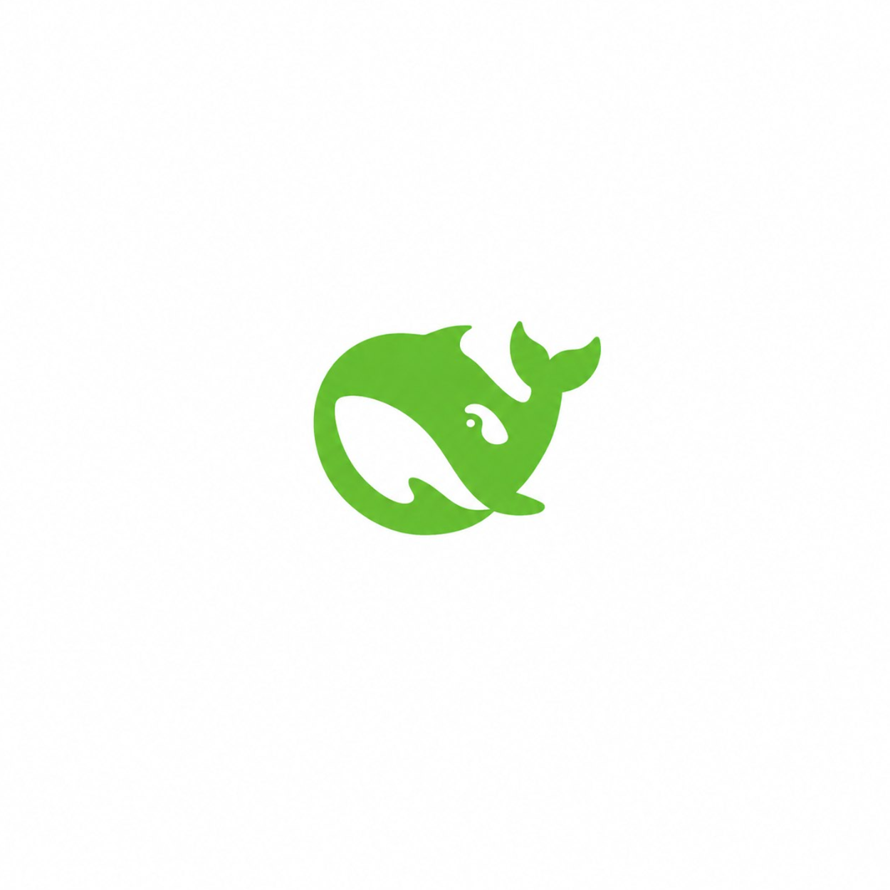
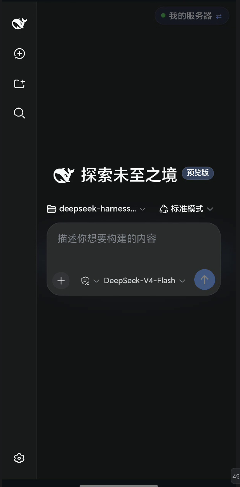
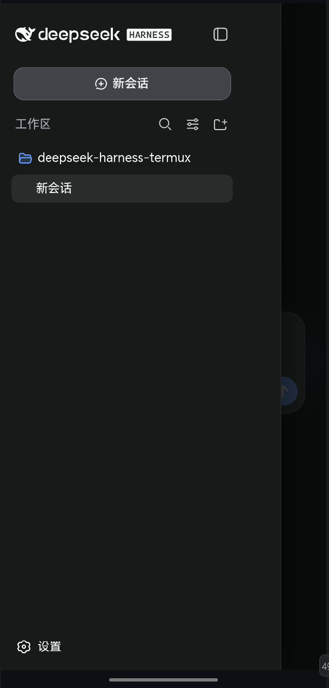
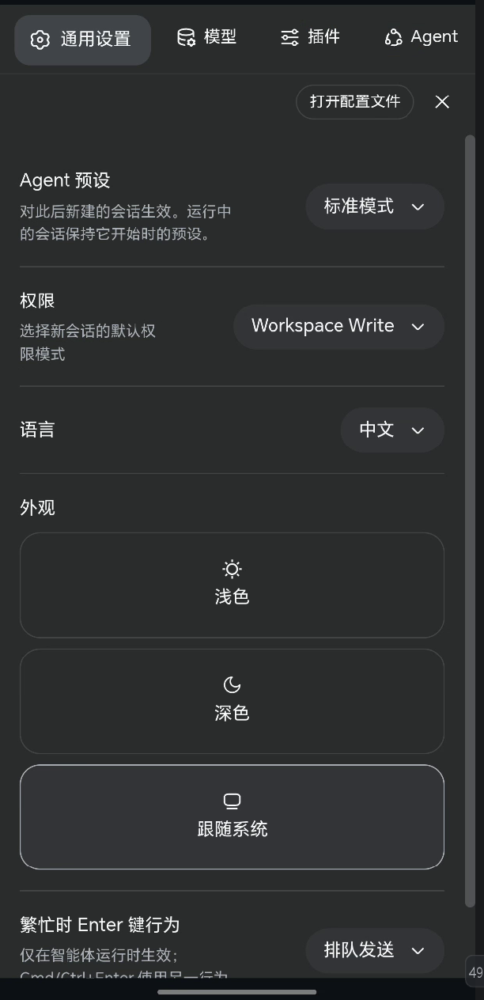

# DeepSeek Harness Android

<p align="center">
  
</p>

<p align="center">
  <strong>DeepSeek Harness 移动端配套应用 · Mobile Companion App for DeepSeek Harness</strong>
</p>

<p align="center">
  <a href="./LICENSE"></a>
  
  
  
</p>

---

## 📖 简介 / Introduction

**中文**：**DeepSeek Harness Android** 是 [DeepSeek Harness](https://github.com/2428424081cn/deepseek-harness) 的轻量级原生 Android 伴侣应用。它把运行在电脑上的 Harness Web 界面装进一个全屏 WebView，并注入移动端 CSS/JS，将桌面版 UI 深度改造成手机布局——让你能在手机上随时查看会话、审批 Agent、切换工作区。

**English**: **DeepSeek Harness Android** is a lightweight native Android companion app for [DeepSeek Harness](https://github.com/2428424081cn/deepseek-harness). It loads the Harness Web UI (running on your computer) into a full-screen WebView and injects mobile CSS/JS to deeply re-layout the desktop interface for phones — so you can view sessions, approve Agents, and switch workspaces on the go.

> ⚠️ **中文**：本应用为非官方第三方伴侣，与 DeepSeek Harness 官方无关。
> **English**: This is an unofficial third-party companion and is not affiliated with the official DeepSeek Harness project.

---

## ✨ 核心特性 / Features

### 📱 移动端深度适配 / Mobile Viewport Optimization

- **中文**：通过注入 CSS/JS，把桌面版界面改造成手机布局。
  - 侧边栏 → **抽屉浮层**（带半透明遮罩，展开时不再挤压聊天区，点遮罩/选会话/按返回键可关闭）。
  - 设置弹窗 → **全屏 + 顶部横向 Tab**。
  - 输入框工具栏（模型选择 / 权限模式）→ **自动收窄**，不再互相遮挡。
  - 工作区名过长 → **自动省略号**，操作模式按钮不再被挤到最右。
  - 修复中文/英文竖排单字换行、边缘到边距、安全区留白等细节。
- **English**: Inject CSS/JS to re-layout the desktop UI for mobile.
  - Sidebar → **overlay drawer** (with a dimmed backdrop; no longer squeezes the chat column; close via backdrop / session tap / back button).
  - Settings dialog → **full-screen with a horizontal top tab bar**.
  - Composer toolbar (model selector / permission mode) → **auto-compact**, no more overlap.
  - Long workspace names → **auto-ellipsis**, the mode button no longer gets pushed to the far right.
  - Fixes single-character vertical wrapping, edge-to-edge spacing, and safe-area padding.

### 🔄 多服务器管理 / Multi-Server Management

- **中文**：保存、切换、编辑、删除多台电脑（IP/域名、端口、HTTP/HTTPS），按最近使用排序，兼容旧版单服务器配置迁移。
- **English**: Save, switch, edit, and delete multiple servers (IP/domain, port, HTTP/HTTPS), sorted by recency, with legacy single-server config migration.

### 🎈 悬浮服务器胶囊 / Floating Server Pill

- **中文**：可拖拽的悬浮胶囊，点击切换服务器；弹窗/报错时自动隐藏。
- **English**: A draggable floating pill for switching servers; auto-hides when a dialog is open or an error is shown.

### 🔙 智能返回键 / Smart Back Navigation

- **中文**：返回键优先关闭抽屉/弹窗 → 网页后退 → 双击退出，防止误触。
- **English**: Back button closes the drawer/dialog first → WebView history back → double-tap to exit.

### ⚡ 原生 JS 桥 / Native JS Bridge

- **中文**：暴露 `window.AndroidBridge`，支持系统通知、震动、模态框状态上报、设备信息获取。
- **English**: Exposes `window.AndroidBridge` for system notifications, vibration, modal-state reporting, and device info.

### 📁 文件上传 / File Chooser

- **中文**：原生支持网页端的文件/图片选择与附件上传。
- **English**: Native support for the Web UI's file/image picker and attachment upload.

### 🔐 局域网友好 / LAN-friendly

- **中文**：支持自签名证书与明文 HTTP（开发/内网场景）。
- **English**: Supports self-signed certificates and cleartext HTTP (dev/LAN scenarios).

### 🌙 深色主题 / Dark Theme

- **中文**：默认深色主题，与 Harness 深色 UI 保持一致。
- **English**: Dark theme by default, matching the Harness dark UI.

---

## 🧭 工作原理 / How It Works

- **中文**：
  1. 手机端启动 App，输入电脑 IP 和端口（默认 `3080`）。
  2. App 用 WebView 加载 `http://<电脑IP>:3080`（或 https）。
  3. `HarnessWebViewClient` 在每次页面加载后注入一段移动端 CSS/JS，把桌面版 UI 改造成手机布局。
  4. `AndroidJsBridge` 暴露 `window.AndroidBridge`，让网页调用原生能力（通知、震动、模态框状态）。
  5. `HarnessChromeClient` 处理文件选择与加载进度。
- **English**:
  1. Launch the app and enter the computer's IP and port (default `3080`).
  2. The app loads `http://<computer-ip>:3080` (or https) in a WebView.
  3. `HarnessWebViewClient` injects a mobile CSS/JS layer after every page load to re-layout the desktop UI.
  4. `AndroidJsBridge` exposes `window.AndroidBridge` so the page can call native features (notifications, vibration, modal state).
  5. `HarnessChromeClient` handles file choosing and load progress.

---

## 🏗️ 技术架构 / Tech Stack

| 项 Item | 说明 Description |
| --- | --- |
| 语言 Language | Kotlin |
| 最低版本 Min SDK | Android 8.0（API 26） |
| 目标/编译版本 Target/Compile SDK | Android 15（API 35） |
| 核心组件 Core | WebView · ViewBinding · Material 3 · AndroidX（Core KTX / AppCompat / Activity KTX / ConstraintLayout / Lifecycle） |
| 构建 Build | Gradle 8.7 · AGP 8.5.2 · Kotlin 2.0.21（版本目录 `libs.versions.toml`） |

---

## 🚀 快速开始 / Getting Started

### 前置要求 / Prerequisites

- **中文**：
  - 电脑上已运行 [DeepSeek Harness](https://github.com/2428424081cn/deepseek-harness)，执行 `dsh web`（默认端口 `3080`）。
  - 手机与电脑处于**同一局域网**。
  - 开发环境：Android Studio Ladybug（2024.2+）或更高、JDK 17、Android SDK 35。
- **English**:
  - A computer running [DeepSeek Harness](https://github.com/2428424081cn/deepseek-harness) via `dsh web` (default port `3080`).
  - Phone and computer on the **same LAN**.
  - Dev environment: Android Studio Ladybug (2024.2+) or newer, JDK 17, Android SDK 35.

### 构建 / Build

**方式一：Android Studio（推荐）/ Method 1: Android Studio (recommended)**

1. **中文**：`File → Open` 打开本项目目录，等待 Gradle 同步完成。**English**: `File → Open` the project, wait for Gradle sync.
2. **中文**：连接手机（开启 USB 调试）或启动模拟器，点击 Run。**English**: Connect a device (USB debugging) or start an emulator, then click Run.

**方式二：命令行 / Method 2: Command Line**

```bash
# Windows
gradlew.bat assembleDebug

# macOS / Linux
./gradlew assembleDebug
```

- **中文**：APK 输出路径：`app/build/outputs/apk/debug/app-debug.apk`。
- **English**: APK output: `app/build/outputs/apk/debug/app-debug.apk`.

### 使用 / Usage

1. **中文**：电脑上运行 `dsh web`，记下电脑局域网 IP（如 `192.168.1.100`）。**English**: Run `dsh web` on the computer and note its LAN IP (e.g. `192.168.1.100`).
2. **中文**：手机安装 APK 后首次启动自动进入「设备与连接管理」，填写 IP 和端口（默认 `3080`），保存即可。**English**: After installing the APK, the first launch opens the connection setup; enter the IP and port (default `3080`) and save.
3. **中文**：之后即可在手机上查看会话、审批 Agent、切换工作区等。**English**: You can then view sessions, approve Agents, switch workspaces, and more.

---

## 🌐 本地化 / Localization

- **中文**：**Web 界面**由上游 DeepSeek Harness 提供，内置国际化（i18n）系统（含英文 `en` 与简体中文 `zh`），界面语言会跟随系统/浏览器语言，或在设置中的语言选项手动切换——英文用户会看到英文界面。**本 App 的原生壳界面**（连接设置页、加载/错误页、悬浮胶囊、「再按一次退出应用」提示等）目前**仅内置简体中文**，暂未提供英文资源。
- **English**: The **Web UI** is provided by upstream DeepSeek Harness, which has a built-in i18n system (English `en` and Simplified Chinese `zh`); it follows the system/browser locale or a manual language setting — so English users will see the web interface in English. The **native shell UI** of this app (connection setup, loading/error screens, floating pill, "tap again to exit" toast, etc.) currently ships **Simplified Chinese only**, with no English resources yet.

> 💡 **中文**：如果你希望原生壳界面也支持英文，欢迎提 PR（新增 `values-en/strings.xml` 并替换布局中的硬编码中文即可）。**English**: If you'd like the native shell to be localizable, PRs are welcome (add `values-en/strings.xml` and replace hardcoded Chinese in layouts).

---

## 📁 项目结构 / Project Structure

```text
app/src/main/
├── AndroidManifest.xml                # 应用清单 / app manifest
├── java/com/deepseek/harness/
│   ├── HarnessApp.kt                  # Application：创建通知渠道 / notification channels
│   ├── MainActivity.kt                # 主界面：WebView + 悬浮胶囊 + 智能返回 / main screen
│   ├── config/
│   │   └── ServerConfigManager.kt     # 服务器配置持久化（SharedPreferences + JSON）
│   ├── ui/
│   │   └── ConnectionSetupActivity.kt # 设备与连接管理页 / connection setup
│   └── webview/
│       ├── AndroidJsBridge.kt         # JS 桥（通知/震动/模态框状态）
│       ├── HarnessChromeClient.kt     # 文件选择、加载进度
│       └── HarnessWebViewClient.kt    # 页面加载 + 移动端 CSS/JS 注入
└── res/                               # 布局、主题、图标、字符串 / layout, theme, icon, strings
```

---

## 📸 截图 / Screenshots

| 主界面 Main UI | 侧边栏抽屉 Sidebar Drawer | 设置面板 Settings Modal |
| :---: | :---: | :---: |
|  |  |  |


---

## ❓ 常见问题 / FAQ

**连不上服务器？/ Can't connect to the server?**

- **中文**：确认电脑上 `dsh web` 正在运行、端口正确（默认 `3080`）；确认手机与电脑在同一 Wi-Fi 且防火墙放行 `3080`；用浏览器访问 `http://<电脑IP>:3080` 验证连通性。
- **English**: Make sure `dsh web` is running with the correct port (default `3080`); ensure the phone and computer share the same Wi-Fi and the firewall allows `3080`; verify by opening `http://<computer-ip>:3080` in a browser.

**界面布局错乱 / 显示不全？/ Layout is broken or truncated?**

- **中文**：移动端适配依赖较新的 Android System WebView，请在 Play 商店保持更新。
- **English**: The mobile adaptation relies on a recent Android System WebView; keep it updated via the Play Store.

**`gradlew` 报找不到 `gradle-wrapper.jar`？/ `gradlew` says `gradle-wrapper.jar` is missing?**

- **中文**：在项目目录执行 `gradle wrapper` 重新生成，或直接用 Android Studio 构建。
- **English**: Run `gradle wrapper` in the project directory to regenerate it, or build with Android Studio.

---

## 📄 开源协议 / License

- **中文**：本项目采用 [Apache-2.0 License](./LICENSE)。图标、商标及相关品牌归属其各自权利人；上游 DeepSeek Harness 采用 MIT 协议。
- **English**: This project is licensed under the [Apache-2.0 License](./LICENSE). Icons, trademarks, and related branding belong to their respective owners; upstream DeepSeek Harness is MIT-licensed.
